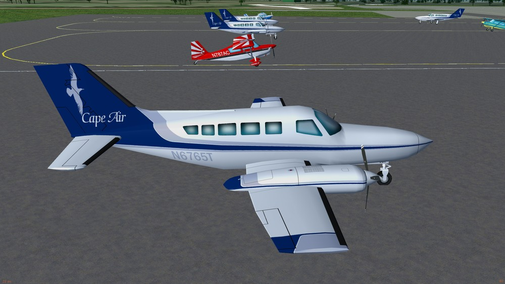
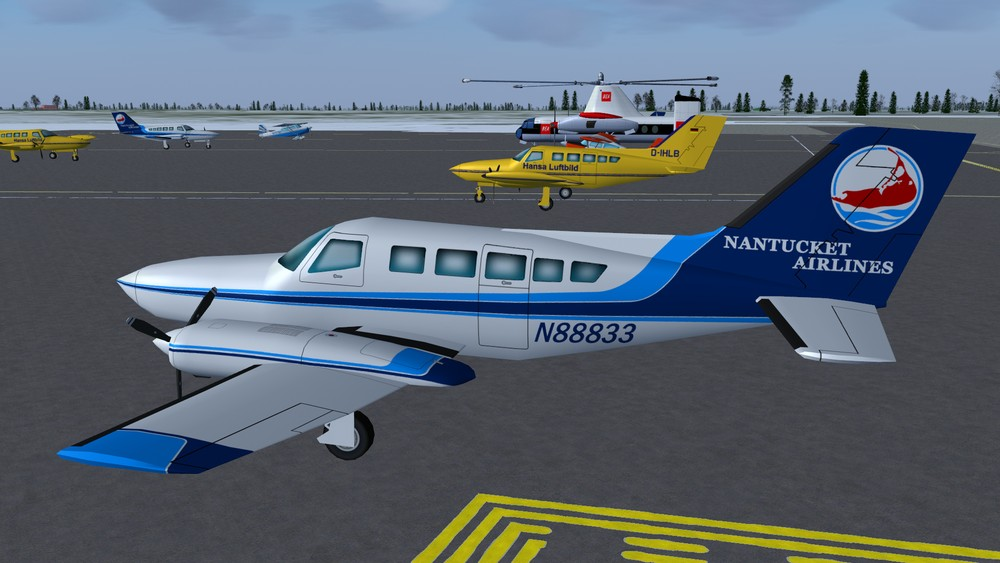
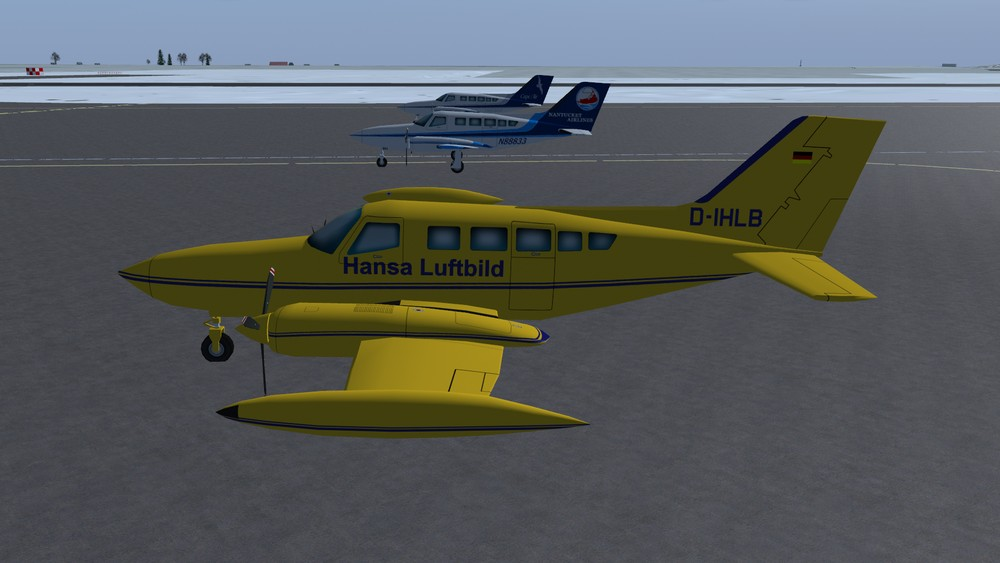
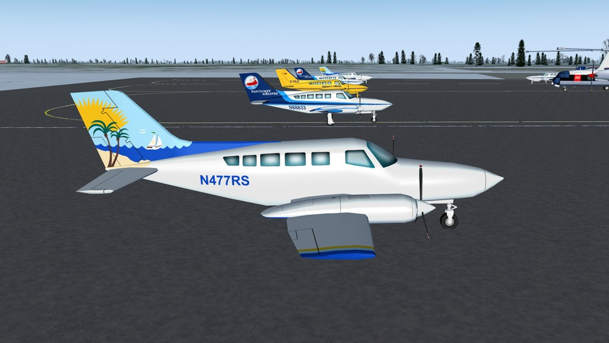
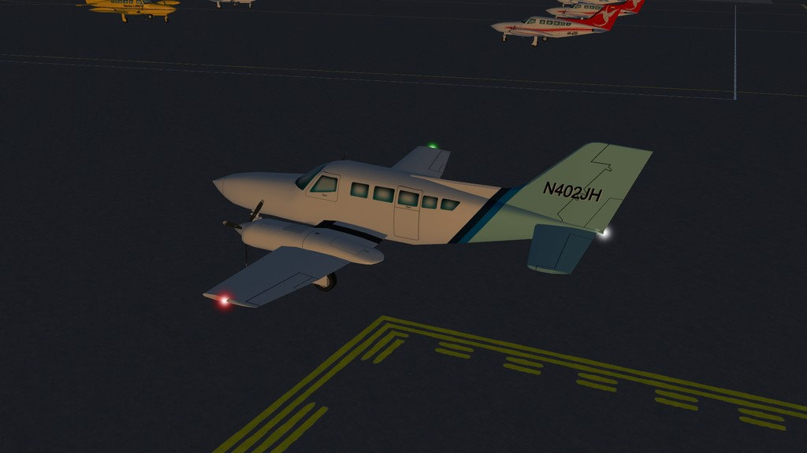
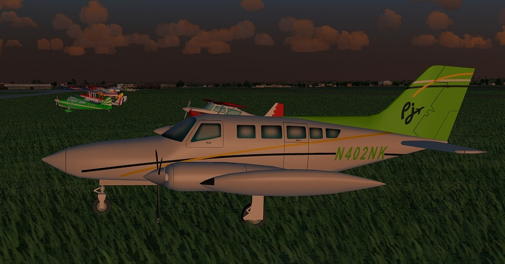
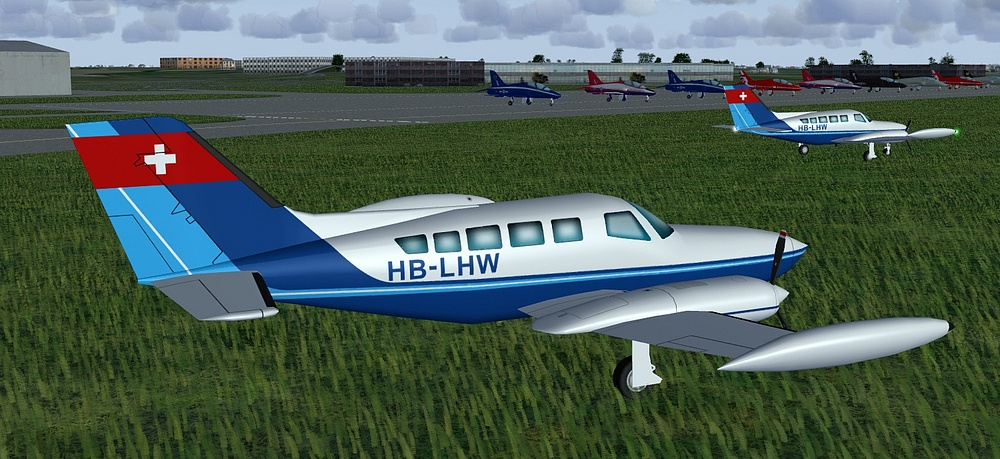
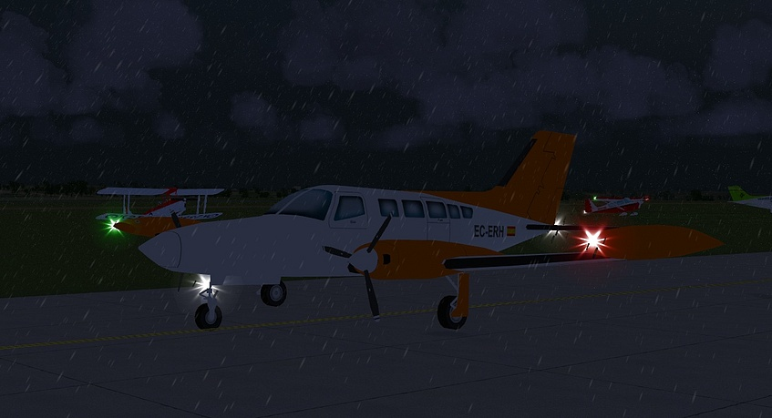

# Cessna 402
### AI Aircraft for FlightGear (With Lights)

*This is still WIP but does work.*

Download the zip file and extract the "c402" folder into the "$FG_ROOT/AI/Aircraft" folder.

To use you will need to create a traffic file, see the wiki for instructions.
 http://wiki.flightgear.org/AI_Traffic